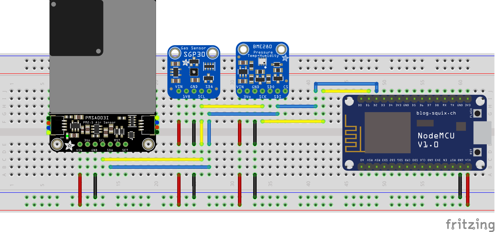

# ESP8266 Air Quality Sensor

Arduino code to implement a MQTT-enabled air quality sensor using an ESP8266 (NodeMCU) microcontroller, BME280 climate sensor, SGP30 gas sensor, and PMA5003I particulate matter sensor. It is designed for use with Home Assistant and supports auto-discovery of all the measurands.

## Usage

Acquire hardware in the [BOM](#bill-of-materials) and connect as per the [Hardware Configuration](#hardware-configuration) section. Set up the MQTT integration for Home Assistant and enable [MQTT Discovery](https://www.home-assistant.io/docs/mqtt/discovery/). Update the [Software Configuration](#software-configuration), [compile](#building), and flash the NodeMCU. Optionally monitor the serial port to see the initialization sequence, consisting of checking communication with the sensors, connecting to WiFi and MQTT, and sending the MQTT discovery messages to Home Assistant. Shortly Home Assistant should populate the sensor values from the sensor.

## Bill of Materials

|Qty|Part Number|Description|Link|
|-|-|-|-|
|1|ESP8266 (NodeMCU v2)|NodeMCU|[Amazon](https://www.amazon.com/HiLetgo-Internet-Development-Wireless-Micropython/dp/B010O1G1ES?th=1)|
|1|BME280|SPI/I2C Temperature/Humidity/Pressure Sensor|[Adafruit](https://www.adafruit.com/product/2652)|
|1|SGP30|I2C VOC and eCO2 Sensor|[Adafruit](https://www.adafruit.com/product/3709)|
|1|PMAS5003I|I2C Particulate Matter Sensor|[Adafruit](https://www.adafruit.com/product/4632)|


## Hardware Configuration

The Fritzing breadboard for the sensor is shown below.



Sensor power comes from the NodeMCU power input (i.e. USB port) and provides +5V to all sensors.  Wiring color corresponds to the signal names:

|Color|Signal|
|-|-|
|Red|+5V USB|
|Black|Ground|
|Blue|SDA|
|Yellow|SCL|

## Software Configuration

> **Warning**
> The MQTT messages that Home Assistant uses to auto-discover this sensor are bigger than the maximum buffer size
> defined in the AdaFruit MQTT Library. In order for auto-discovery to work, you must find and change the `MAXBUFFERSIZE`
> constant in the `Adafruit_MQTT.h` file and set it to a larger value like `500`. Migrating to the PubSub library may
> fix this, and is under investigation.

The `config.cpp-sample` file should be copied and renamed to `config.cpp`, and the following settings filled in (these sensitive values should not be stored in source control):

```cpp
const char * wifi_ssid = "ssid-iot";
const char * wifi_passwd = "ssid-psk";
```

Set these to match the SSID and PSK you wish to use to connect this sensor.

```cpp
const char * mqtt_host = "mqtt.local";
const char * mqtt_user = "sensors";
const char * mqtt_passwd = "sensors";
const char * mqtt_fingerprint = "01 23 45 67 89 AB CD EF 01 23 45 67 89 AB CD EF 01 23 45 67";
const uint16_t mqtt_port = MQTT_DEFAULT_PORT
```

Set these to match the ACL of your MQTT broker. Anonymous connection to the MQTT broker is not currently supported. TLS connections are supported by setting the `mqtt_fingerprint` variable to the SHA1 fingerprint of the X509 certificate served by the MQTT broker. [See here](https://arduino-esp8266.readthedocs.io/en/latest/esp8266wifi/bearssl-client-secure-class.html#setfingerprint-const-uint8-t-fp-20-setfingerprint-const-char-fpstr) for more details. TLS connections can be disabled by commenting out the `MQTT_SECURE` definition in `config.h`.

Additional settings are in `config.h`:

```cpp
#define READ_BASELINE_INTERVAL  2
#define READ_SENSOR_INTERVAL    1
#define PUBLISH_INTERVAL        30
```

These define the intervals of the main sensor tasks. `READ_BASELINE_INTERVAL` sets the interval *in minutes* between reading the baseline values of the SGP30 sensor and writing them to EEPROM. The default is to store them every hour as recommended by the datasheet. The baseline values are persisted across resets. `READ_SENSOR_INTERVAL` is the polling interval for the sensors themselves, and `PUBLISH_INTERVAL` is how often new values are sent to MQTT. These two settings are in *seconds* and default to polling the sensors once per second and publishing data every 30 seconds.

```cpp
// #define PUBLISH_ERROR_COUNT
```

Uncomment this line to send PMS5003I communication error counts to MQTT on every sensor polling interval. By default these are reported along with the baseline settings every hour. Note this is in the code because I did not have a PMS5003I sensor originally and use a second Arduino to perform an I2C to UART bridge to emulate the I2C interface of the PMS5003I. Hopefully the actual I2C board does not have nearly as many communication errors as mine.

```cpp
#define PMS5003_REPORT_ENV
```

Comment this line to report the "standard atmosphere" values from the PMS5003 instead of the compensated values.

```cpp
#define MQTT_TOPIC_BASE "sensor/aq"
```

This defines the MQTT base topic.  MQTT topics have the form `${MQTT_TOPIC_BASE}/${SGP30_SN}/${ENDPOINT}` where `SGP30_SN` is the serial number of the SGP30 sensor (used as the module serial number) and `${ENDPOINT}` is the topic endpoint. See the [MQTT Endpoints](#mqtt-endpoints) section for more details.

```cpp
#define MQTT_SECURE
```

Comment this line to use an insecure connection to the MQTT server.

```cpp
#define MQTT_PROCESS_MS 100
```

This sets the timeout for the `Arduino_MQTT_Client::processPackets()` call to process topic subscriptions. This gets called in the main loop so should be set relatively short (and definintely shorter than the minimum task interval for sensor polling or reporting).

```cpp
#define DEBUG
#define DEBUG_BAUD 115200
```

Comment out the first line to disable debug logging to the serial port, or change `DEBUG_BAUD` to the preferred baud rate of your serial terminal (change `platformio.ini` as well if you are using the integrated terminal emulator).

## Building

The Arduino code depends on several libraries that must be installed first. I had to install BusIO and Unified Sensor manually for PlatformIO to successfully build the code.

|Library|Version|Usage|
|-|-|-|
|[Adafruit MQTT Library](https://github.com/adafruit/Adafruit_MQTT_Library)|^2.5.0|MQTT Communication|
|[Adafruit SGP30 Sensor](https://github.com/adafruit/Adafruit_SGP30)|^2.0.0|SGP30 Driver|
|[Adafruit BME280 Library](https://github.com/adafruit/Adafruit_BME280_Library)|^2.1.4|BME280 Driver|
|[Adafruit PM25 AQI Sensor](https://github.com/adafruit/adafruit/Adafruit_PM25AQI)|^1.0.6|PMAS5003I Driver|
|[Task Scheduler](https://github.com/arkhipenko/TaskScheduler)|^3.3.0|Arduino Cooperative Multitasking|
|[EEPROM Rotate](https://github.com/xoseperez/EEPROM_Rotate)|^0.9.2|Flash Wear Leveling for NodeMCU|
|[Adafruit BusIO](https://github.com/adafruit/Adafruit_BusIO)|^1.8.2|Dependency of Adafruit PM25 AQI Sensor Library|
|[Adafruit Unified Sensor](https://github.com/adafruit/Adafruit_Sensor)|^1.1.4|Dependency of BME280 and SGP30 Sensor Libraries|

My build environment is Visual Studio Code with the [PlatformIO](https://platformio.org/install/ide?install=vscode) plugin. The `platformio.ini` file should automatically install the required libraries when building the first time.

## MQTT Endpoints

There are five MQTT endpoints defined for this sensor:
- `${MQTT_TOPIC_BASE}/${SGP30_SN}/data` : JSON objects containing sensor data are published to this endpoint by the
    sensor, every `PUBLISH_INTERVAL` seconds. The JSON structure is as follows:

    ```json
    {
        "t": 29.3,
        "p": 100794.4,
        "rh": 37.1,
        "tvoc": 8,
        "co2": 400,
        "pm10": 12,
        "pm25": 19,
        "pm100": 22,
        "particles03": 2163,
        "particles05": 634,
        "particles10": 134,
        "particles25": 11,
        "particles50": 5,
        "particles100": 1
    }
    ```

    The reported values include temperature in degrees celsius, pressure in mbar, relative humidity in percent, total VOC 
    concentration in ppb, effective CO2 concentration in ppb, particulate matter concentration (1.0µm, 2.5µm, and 10µm 
    sizes) in µg/m³, and actual particle counts for the 0.3µm, 0.5µm, 1.0µm, 2.5µm, 5.0µm, and 10µm size buckets.

- `${MQTT_TOPIC_BASE}/${SGP30_SN}/status` : JSON objects containing sensor status are published to this endpoint by the
    sensor, every `READ_BASELINE_INTERVAL` minutes. The JSON structure is as follows:
    
    ```json
    {
        "status": "ONLINE",
        "sgp30_errors": 0,
        "pms5003_errors": 69,
        "bl_tvoc": 37545,
        "bl_eco2": 37744
    }
    ```

    The `status` field is always set to `ONLINE` currently. The number of errors reported by the SGP30 and PMS5003 
    interfaces are reported in their respective fields, and the current SGP30 baseline values are reported as well.

- `${MQTT_TOPIC_BASE}/${SGP30_SN}/echo` : This is used as a sensor health check. Data published to this endpoint is
    sent back on the `${MQTT_TOPIC_BASE}/${SGP30_SN}/echo/reply` endpoint.

- `${MQTT_TOPIC_BASE}/${SGP30_SN}/echo/reply` : Response endpoint for echo data.

- `${MQTT_TOPIC_BASE}/${SGP30_SN}/cmd` : Sensor command interface. Currently only a `resetBaselines` command is
    implemented, which resets the SGP30 baseline values to 0. Send `resetBaselines` as a string to this endpoint
    to reset the baselines.

## Home Assistant Auto-Discovery

The sensor provides auto-discovery data for Home Assistant to automatically create entities for the sensor.  Not all fields are auto-created, but the following sensors are created:

- `sensor.aq_{sgp30id}_aqi_errors`: PMS5003 Running Error Count (resets to 0 on sensor reset)
- `sensor.aq_{sgp30id}_baseline_eco2`: Effective CO2 baseline value from SGP30
- `sensor.aq_{sgp30id}_baseline_tvoc`: Total VOC baseline value from SGP30
- `sensor.aq_{sgp30id}_eco2`: Effective CO2 concentration (ppb)
- `sensor.aq_{sgp30id}_humidity`: Relative humidity (%)
- `sensor.aq_{sgp30id}_pm10`: 1.0µm particulate matter concentration (µg/m3)
- `sensor.aq_{sgp30id}_pm25`: 2.5µm particulate matter concentration (µg/m3)
- `sensor.aq_{sgp30id}_pm100`: 10µm particulate matter concentration (µg/m3)
- `sensor.aq_{sgp30id}_pressure`: Atmospheric pressure (mbar)
- `sensor.aq_{sgp30id}_sgp_errors`: SGP30 Running Error Count (resets to 0 on sensor reset)
- `sensor.aq_{sgp30id}_temperature`: Air temperature (°C)
- `sensor.aq_{sgp30id}_tvoc`: Total VOC concentration (ppm)

## License

MIT License

## Author

This projects was created in 2021 by Jonathan Krauss (@asymworks).
